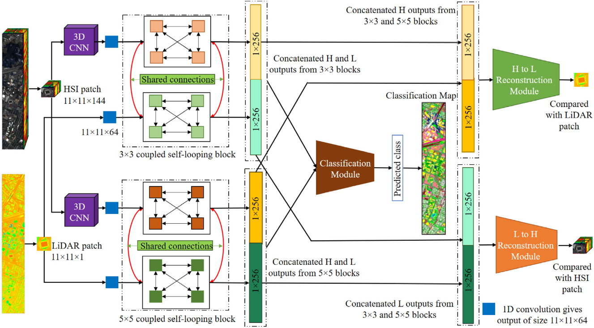

# Self-supervision-assisted-multimodal-remote-sensing-image-fusion-with-coupled-CNNs-and-self-loops
Recently, remote sensing community has seen a surge in the use of multimodal data for different tasks such as land cover classification, change detection and many more. However, handling multimodal data requires synergistically using the information from different sources. Currently, deep learning (DL) techniques are being religiously used in multimodal data fusion owing to their superior feature extraction capabilities. But, DL techniques have their share of challenges. Firstly, DL models are mostly constructed in the forward fashion limiting their feature extraction capability. Secondly, multimodal learning is generally addressed in a supervised setting, which leads to high labelled data requirement. Thirdly, the models generally handle each modality separately, thus preventing any cross-modal interaction. Hence, we propose a novel self-supervision oriented method of multimodal remote sensing data fusion. For effective cross-modal learning, our model solves a self-supervised auxiliary task to reconstruct input features of one modality from the extracted features of another modality, thus enabling more representative pre-fusion features. To counter the forward architecture, our model is composed of convolutions both in backward and forward directions, thus creating self-looping connections, leading to a self-correcting framework. To facilitate cross-modal communication, we have incorporated coupling across modality-specific extractors using shared parameters. We evaluate our approach on three remote sensing datasets, namely Houston 2013 and Houston 2018, which are HSI-LiDAR datasets and TU Berlin, which is an HSI-SAR dataset, where we achieve the respective accuracy of 93.08%, 84.59% and 73.21%, thus beating the state of the art by a minimum of 3.02%, 2.23% and 2.84%.



# URL to the paper: 
>[https://www.sciencedirect.com/science/article/pii/S0893608023002058](https://www.sciencedirect.com/science/article/pii/S0893608023002058)

# Requirement:

```
Tensorflow 2 
```
# Steps:

```
1. Download the dataset from the provided URL in data folder
```
```
2. Run DataPrepare.py
```
```
3. Run model.py
```
# Citation
If using the concept or code, kindly cite the paper as: S. Pande and B. Banerjee. Self-supervision assisted multimodal remote sensing image classification with coupled self-looping convolution networks. In the Neural Networks Journal, April 2023.

You can also use the bibtex as:
```
@article{pande2023self,
  title={Self-supervision assisted multimodal remote sensing image classification with coupled self-looping convolution networks},
  author={Pande, Shivam and Banerjee, Biplab},
  journal={Neural Networks},
  volume={164},
  pages={1--20},
  year={2023},
  publisher={Elsevier}
}
```
